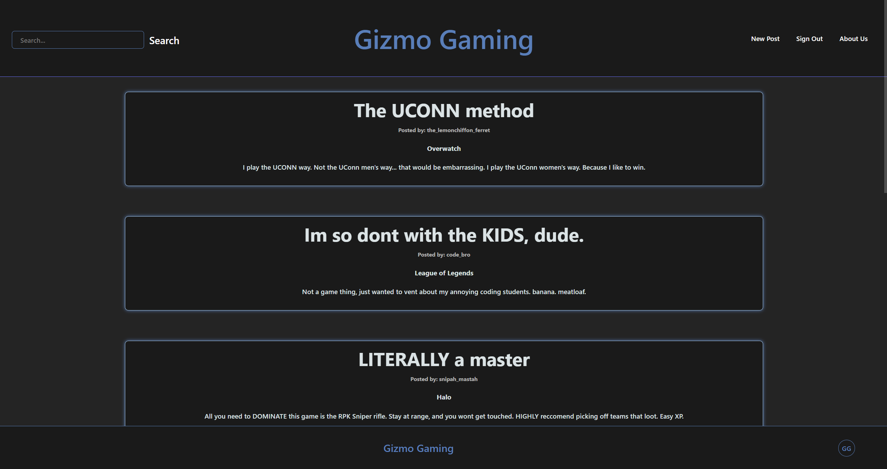
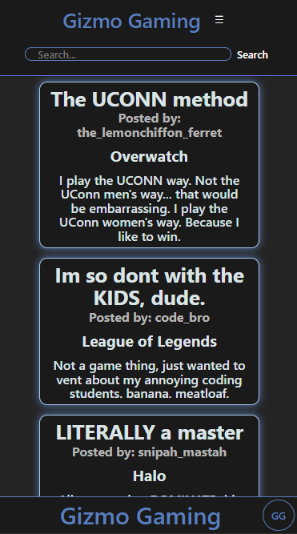

# Gizmo Gaming
  
   
   
   
  ## Description
  
  This application is built to provide a social platform for gamers specifically. Our goal is to help make new gamers, or even veteran gamers who are looking to get into a new game. In Gizmo-Gaming, we offer gamers a platform to connect and share they individual game knowledge with others. This can be in the form of character builds, game-play tactics, as well as strategies for improved win-rates.   Post your own content and let the community vote to help helpful and thoughtful build progress to the top of search pages to help give new gamers the best chance and seeing the most accurate and popular information as possible.   Our goal is to help gamers connect and share their knowledge with others to help improve the gaming community as a whole.
   
   
   
  ## Table of Contents
  
  - [Installation](#installation)
  - [Usage](#usage)
  - [Credits](#credits)
  - [Features](#features)
  - [How To Contribute](#how-to-contribute)
  - [Tests](#tests)
  - [Future Development](#future-development)
  - [License](#license)
  - [Questions](#questions)
   
   
   
  ## Installation
  
  To install this application, follow these steps:  
  1. Clone the repository from the <a href="git@github.com:mighty-little-coder/gizmo-gaming.git">GitHub repository</a> to your local machine. 
  2. Open the terminal and navigate to the directory where the repository is located. 
  3. Run `npm install` to install the necessary dependencies. 
  4. Run `npm start` to start the application. 
  5. Open your web browser and navigate to `localhost:3001` to view the application. 
  6. Enjoy the application! 
   
   
   
  ## Usage
  To view the finished product, click this <a href="https://gizmo-gaming-055183e9597f.herokuapp.com/">link!</a>

To run the application locally, follow these steps:  
  1. Open your web browser and navigate to `localhost:3001`. 
  2. Sign up for an account or log in if you already have one. 
  3. Consider creating a profile page complete with a profile picture, a bio, and a list of your favorite games. 
  4. Once logged in, you can view posts from other users, create your own posts, and vote on other posts. 
  5. You can also search for specific games or posts using the search bar. 
  6. Further refine the search by filtering the results via the tags in the side bar. 
  7. Enjoy the application! 

    
  
   
   
   
  ## Credits
  
  - <a href="https://chat.openai.com/">ChatGPT 3.5</a>
  - <a href="https://github.com/features/copilot?ef_id=_k_CjwKCAiAq4KuBhA6EiwArMAw1FOutqMK0saZxH8FwReh32EgrB9jOkJA2Gi0O3-RqIINbuOsOHKHhxoCfKwQAvD_BwE_k_&OCID=AIDcmmc3fhtaow_SEM__k_CjwKCAiAq4KuBhA6EiwArMAw1FOutqMK0saZxH8FwReh32EgrB9jOkJA2Gi0O3-RqIINbuOsOHKHhxoCfKwQAvD_BwE_k_&gad_source=1&gclid=CjwKCAiAq4KuBhA6EiwArMAw1FOutqMK0saZxH8FwReh32EgrB9jOkJA2Gi0O3-RqIINbuOsOHKHhxoCfKwQAvD_BwE">Github CoPilot</a>
  - <a href="https://leewarrick.com/">Lee Warrick</a> UCONN Bootcamp Instructor
  - <a href="https://github.com/miacias">Mia Ciasullo</a> UCONN Bootcamp Instructor
   
   
   
  ## Features
  
  - User authentication
  - User profiles
  - Post creation
  - Post searching
  - Post filtering
  - Post editing
   
   
   
  ## How to Contribute
  
  To contribute to this project, please contact the creator of this project via the contact information provided below. Otherwise, feel free to fork the <a href="https://github.com/mighty-little-coder/gizmo-gaming">repository</a> and make changes as you see fit. If you think the changes would benefit the project, please submit a pull request.
   
   
   
  ## Tests
  
  N/A
   
   
   
  ## Future Development

  - Add a friend system
  - Add a notification system
  - Add a game recommendation system
  - Add a game review system
  - Add a game rating system
  - Add a game search system
  - Add a game tag system
  - Add a game post tag system
  - Add a game post vote system
  - Add a game post comment system
  - Add a game post report system
  - Add a game post share system
  - Add a game post save system
   
   
   
  ## License
  
  This project is licensed under the MIT LICENSE - see the <a href="https://opensource.org/licenses/MIT">MIT LICENSE</a> file on OpenSourceInitiative.org for details.
   
   
   
  ## Questions
  
  For further questions, please connect with us on our GitHubs at <a href="https://github.com/mighty-little-coder">mighty-little-coder</a> or <a href="https://github.com/RonaldMartin02">ronaldmartin02</a>, 
  or contact us via email at our GizmoGaming <a href="gizmo.gaming@email.gg">email</a>.